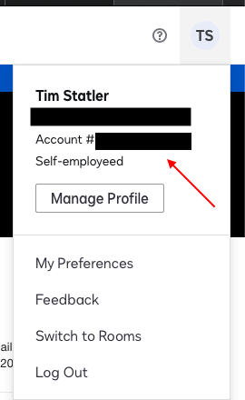

# DocuSign Python Example

This example demonstrates a simple use of the [DocuSign Python SDK](https://github.com/docusign/docusign-python-client) to request information for an existing DocuSign envelope ID.

## Requirements

To run this example you will need a DocuSign developer account that contains at least one
existing envelope.

* Access token -- Generate an OAuth token:  https://developers.docusign.com/oauth-token-generator
* Envelope ID -- The ID of the envelope for which you are requesting information. You can obtain the ID from the final part of the envelop's URI in your demo account (e.g. https://appdemo.docusign.com/documents/details/8994ad85-d203-46d3-b553-7b59c3495033).
* Account ID --  Obtain your account ID at https://demo.docusign.com. Your account ID shown in the drop down in the upper right corner of the screen by your picture or the default picture.



## Usage

```
Usage: main.py [-h] --access_token ACCESS_TOKEN --account_id ACCOUNT_ID --envelope_id ENVELOPE_ID
```


